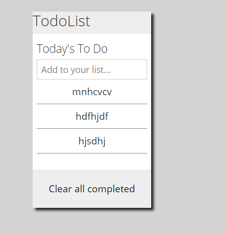

# MyTodo-App
This app helps user organize their work. A user can create a todo, he/she can create more todo lists. A user can drag and drop todos to reorganize the todos. The app is build using JavaScript, HTML/CSS, Webpack, and ES6 syntax.

## About the app



## Getting Started

## Setup

To get started, you should first get this file in your local machine by cloning or forking this project or typing in your terminal

```
 git clone https://github.com/elisha2kyakpo1/MyTodo-App.git

 cd MyTodo-App

 npm install webpack webpack-cli --save-dev

 npn install

 npm run build
 ```
Just run the command below for webpack to compile the code.

## Contributing

Contributions, issues and feature requests are welcome! Start by:

Forking the project

Cloning the project to your local machine

cd into the project directory

```
 cd MyTodo-App

  Run git checkout -b your-branch-name
```

Make your contributions

Push your branch up to your forked repository

Open a Pull Request with a detailed description to the development branch of the original project for a review

---

Built With

This project was built using these technologies.

```
Javascript

Webpack

HTML/CSS

Bootstrap

ESlint

VSCode editor

Git

Github
```

## Contributors

## Elisha Kyakopo

  Linkedin: [Elisha Kyakopo](https://www.linkedin.com/in/elisha-kyakopo/)

  Github: [@elisha2kyakpo1](https://github.com/elisha2kyakpo1)

  Twitter: [@elisha1k](https://twitter.com/Elisha1k)

## Contributions

Contributions, issues and requests are welcome

## Show support

Give a star if you like the project